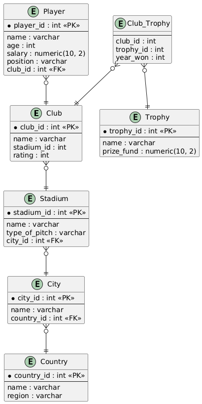

# Service for Finding a Football Club for Players

## Описание моделей

### Модели предметной области

1. **Country**

    Содержит данные о странах, связанных с городами и клубами.

    **Атрибуты:**
    * `country_id`: Уникальный идентификатор страны (первичный ключ).
    * `name`: Название страны.
    * `region`: Регион, к которому относится страна.

2. **City**

    Хранит данные о городах, связанных со странами и стадионами.

    **Атрибуты:**
    * `city_id`: Уникальный идентификатор города (первичный ключ).
    * `name`: Название города.
    * `country_id`: Внешний ключ, указывающий на страну.

3. **Stadium**

    Содержит информацию о стадионах, связанных с городами.

    **Атрибуты:**
    * `stadium_id`: Уникальный идентификатор стадиона (первичный ключ).
    * `name`: Название стадиона.
    * `type_of_pitch`: Тип покрытия стадиона.
    * `city_id`: Внешний ключ, указывающий на город.

4. **Club**

    Хранит данные о футбольных клубах, включая их стадионы и рейтинги.

    **Атрибуты:**
    * `club_id`: Уникальный идентификатор клуба (первичный ключ).
    * `name`: Название клуба.
    * `stadium_id`: Внешний ключ, указывающий на стадион клуба.
    * `rating`: Рейтинг клуба (от 0 до 100).

5. **Player**

    Содержит информацию об игроках и их клубах.

    **Атрибуты:**
    * `player_id`: Уникальный идентификатор игрока (первичный ключ).
    * `name`: Имя игрока.
    * `age`: Возраст игрока.
    * `salary`: Зарплата игрока.
    * `position`: Позиция игрока.
    * `club_id`: Внешний ключ, указывающий на клуб.

6. **Trophy**

    Хранит данные о трофеях, разыгрываемых в футбольных турнирах.

    **Атрибуты:**
    * `trophy_id`: Уникальный идентификатор трофея (первичный ключ).
    * `name`: Название трофея.
    * `prize_fund`: Призовой фонд трофея.

7. **Club_Trophy**

    Связывает клубы с выигранными трофеями и годом победы.

    **Атрибуты:**
    * `club_id`: Внешний ключ, указывающий на клуб.
    * `trophy_id`: Внешний ключ, указывающий на трофей.
    * `year_won`: Год победы.
    * Композитный первичный ключ: (`club_id`, `trophy_id`, `year_won`).

8. **Users**

    Представляет данные всех пользователей системы.

    **Атрибуты:**
    * `user_id`: Уникальный идентификатор пользователя (первичный ключ).
    * `username`: Уникальное имя пользователя.
    * `password`: Хэш пароля пользователя.
    * `role`: Роль пользователя (например, "user" или "admin").

---

## Основной функционал

### Back-End

Реализован на **psycopg2** для взаимодействия с PostgreSQL. Основной функционал:
- Получение данных о клубах, игроках, трофеях, стадионах и городах.
- Фильтрация клубов по рейтингу, стадионам и другим параметрам.
- Аутентификация пользователей.

### Front-End

Создан на **Streamlit** для интерактивного взаимодействия с пользователем. Основной функционал:
- Отображение списка футбольных клубов.
- Фильтрация клубов по заданным параметрам.
- Визуализация данных в виде таблиц и графиков.

---

## Диаграмма модели

---

## Пример использования

1. Пользователь заходит в интерфейс Streamlit.
2. Выбирает фильтры для клубов (например, по рейтингу или стадиону).
3. Front-End передает запрос на Back-End для выполнения операции.
4. Back-End возвращает отфильтрованные данные, которые отображаются в интерфейсе.

---

## Комментарии к проекту

Проект реализует основные CRUD-операции с базой данных и позволяет интерактивно получать данные о футбольных клубах, игроках и трофеях, что делает его полезным инструментом для футболистов в поиске подходящего клуба.

